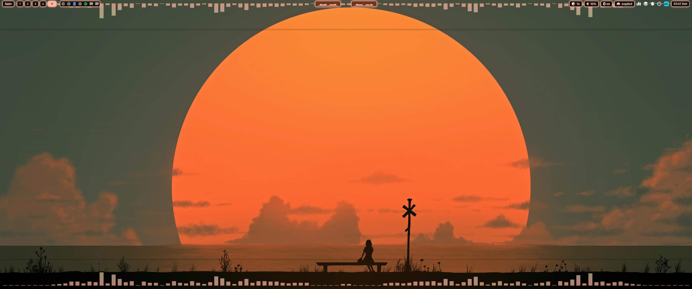

# 🎵 Cava Waybar Setup

Beautiful clickable audio visualizer for Waybar with automatic wallpaper color theming.



## ✨ Features

- Two clickable Cava visualizations in Waybar (left and right)
- Top Cava with flipped orientation (bars go down)
- Bottom Cava with normal orientation (bars go up)
- Automatic color theming from wallpaper using Matugen
- Transparent floating windows
- Auto-reload on wallpaper change
- Toggle split window functionality

## 📦 Dependencies

```bash
# Arch/Manjaro
sudo pacman -S cava kitty jq hyprland waybar
yay -S matugen swww  # or paru -S matugen swww
```

**Required:**
- `cava` - Audio visualizer
- `kitty` - Terminal emulator
- `jq` - JSON processor
- `hyprland` - Window manager
- `waybar` - Status bar
- `matugen` - Color theme generator
- `swww` or `hyprpaper` - Wallpaper daemon

## 🚀 Installation

### 1. Copy Scripts

```bash
# Copy all scripts to waybar scripts folder
cp waybar/scripts/* ~/.config/waybar/scripts/

# Make them executable
chmod +x ~/.config/waybar/scripts/cava-opener.sh
chmod +x ~/.config/waybar/scripts/restart-cava.sh
chmod +x ~/.config/waybar/scripts/restart-cava-top.sh
```

### 2. Add Waybar Modules

Add to your `~/.config/waybar/config`:

```json
"modules-center": [
    "custom/cava-left",
    "hyprland/window",
    "custom/cava-right"
]
```

Then copy the module definitions from `waybar/modules.json.snippet` to your `~/.config/waybar/modules.json`

### 3. Setup Matugen Templates

```bash
# Copy templates
mkdir -p ~/.config/matugen/templates
cp matugen/templates/* ~/.config/matugen/templates/
```

Add the content from `matugen/config.toml.snippet` to your `~/.config/matugen/config.toml`

### 4. Add Hyprland Rules

Add to your `~/.config/hypr/hyprland.conf`:

```conf
source = ~/.config/hypr/cava-rules.conf
```

Then copy `hypr/cava-rules.conf` to `~/.config/hypr/`

### 5. Reload Everything

```bash
hyprctl reload
killall waybar && waybar &
matugen image /path/to/your/wallpaper.jpg
```

## 🎮 Usage

- **Left click on left Cava** → Opens top visualization (bars going up)
- **Left click on right Cava** → Opens bottom visualization (bars going down)  
- **Click again** → Closes the visualization
- **Change wallpaper** → Colors automatically update

## 🎨 Customization

### Window Size

Edit `~/.config/hypr/cava-rules.conf`:
```conf
windowrulev2 = size 100% 10%, title:^(cava_top)$    # 10% height
windowrulev2 = size 100% 15%, title:^(cava_bottom)$ # 15% height
```

### Transparency

Edit `~/.config/waybar/scripts/cava-opener.sh` line 31:
```bash
-o background_opacity=0.0  # 0.0 = fully transparent, 1.0 = opaque
```

### Colors

Colors are auto-generated from wallpaper. To manually adjust, edit:
- `~/.config/cava/config_top`
- `~/.config/cava/config_bottom`

## 🔧 Troubleshooting

**Cava doesn't open:**
```bash
killall -9 cava
~/.config/waybar/scripts/cava-opener.sh bottom
```

**Too many Cava processes running:**
```bash
killall -9 cava
```

**Colors don't update after wallpaper change:**
```bash
matugen image $(swww query | grep -oP 'image: \K.*')
```

## 📝 Notes

- This setup uses Kitty terminal. If you use a different terminal, adjust the scripts accordingly.
- Window positioning works best with floating windows in Hyprland.

## 📄 License

MIT License - Feel free to use and modify!

## 🙏 Credits

- Built for and tested with
- [ML4W Dotfiles](https://github.com/mylinuxforwork/dotfiles) by Stephan Raabe
- All Cava functionality (Waybar visualizations and clickable windows) created through many iterations and debugging sessions 😅

## ⚠️ Disclaimer

This is my first shared project and I'm not a professional developer! 🎓

The setup works great on my CachyOS/Hyprland system. If it doesn't work on yours, you might need to do some tweaking - but that's part of the fun of Linux, right? Good luck! 🍀


